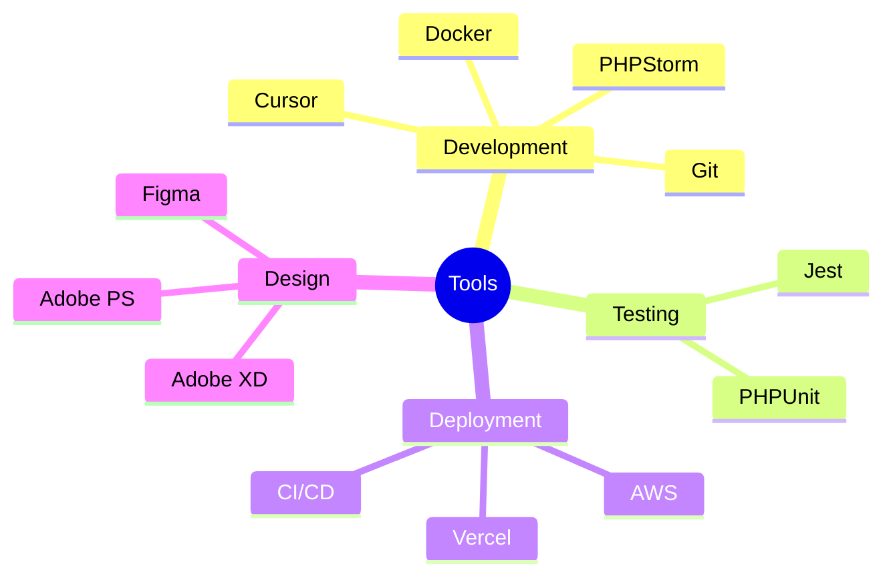

## 👨‍💻 About PasperFection

I'm a passionate developer who loves turning complex problems into elegant solutions. Whether it's crafting clean code or experimenting with new technologies, I'm always up for a challenge!

## 🛠️ Tech Stack

### Languages

  
  
  
  
  
  

### Currently Learning

  
  

### Tools & Environments

## 📊 GitHub Stats

  

## 🌟 Featured Projects

<table>
  <tr>
    <td align="center">
      
       
      The Solana-based token platform
    </td>
    <td align="center">
      
       
      A Feature rich one-step authentication system
    </td>
  </tr>
</table>

## 💡 What I'm Up To

- 🔭 Working on: Building awesome web applications
- 📚 Learning: Advanced TypeScript patterns and C# development
- 👯 Looking to collaborate on: Innovative open-source projects
- 🤔 Exploring: Cloud architecture and serverless computing

## 📫 Let's Connect!

Feel free to reach out if you want to:
- 🤝 Collaborate on a project
- 💬 Discuss technology trends
- 🎯 Share interesting development challenges

You can find me on Twitter [@pasperfection](https://twitter.com/pasperfection) or drop me a message here on GitHub!

---

  
### "Code is like humor. When you have to explain it, it's bad." – Cory House

