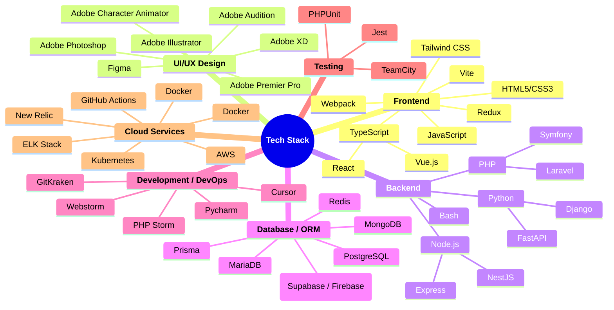

# 💻 PasperFection | Full-Stack Developer

Ervaren full-stack developer met een scherp oog voor business value en meer dan 5 jaar ervaring in het bouwen van enterprise-grade applicaties. Ik lever oplossingen die zowel technisch als strategisch sterk zijn.

  

---

## 💪 Wat mij onderscheidt
- **Full-Stack Expertise**: Kennis van zowel frontend- als backend-technologieën.
- **Business Inzicht**: Begrip van business processen en ROI-gedreven ontwikkeling.
- **Innovatie**: Up-to-date met de laatste technologische ontwikkelingen.
- **Communicatie**: Sterk in technische én zakelijke communicatie.

---

## 🎯 Kerncompetenties

---
## 💼 Werkervaring

**Full-Stack Developer** | PasperFection (2016-heden)
- Teamleider van 3 developers
- Implementatie van microservices architectuur
- 40% prestatieverbetering

**Junior Full-Stack Developer** | PasperFection (2013-2021)
- Backend modernisatie, API-ontwikkeling, performance en security optimalisatie

---

## 🚀 Projecten & Prestaties

### 💱 Fullstax DEFI Web Platform
**Crypto Trading Platform**: Real-time prijsupdates, geautomatiseerde tradingstrategieën, wallet-integratie.

- Ontwikkeling van schaalbare microservices.
- 40% prestatieverbetering.
- CI/CD pipeline met 99.9% uptime.
- Leiding over een team van 5 developers.

### 🔐 DirectLinx Authentication System
**DirectLinx Auth Platform**: Multi-factor authenticatie, OAuth2, biometrische verificatie.

- Geavanceerd authenticatie systeem met biometrie en integraties.
- 30% reductie in login-gerelateerde support tickets.

---

